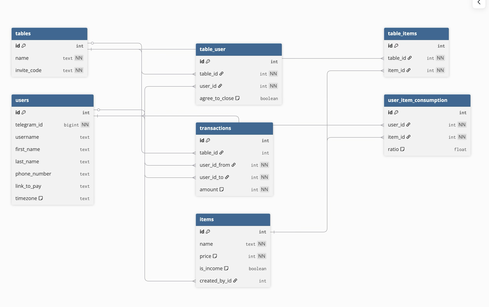

## Обзор проекта

**BillSeparatorBot** — Telegram-бот для коллективного управления расходами и автоматического разделения счетов между участниками.

### Основные возможности:
- Создание "столов" (групп расходов)
- Приглашение участников по уникальному коду
- Добавление расходов и доходов
- Гибкое разделение платежей (поровну, по долям, по позициям)
- Автоматический расчет долгов с минимизацией переводов
- Генерация платежных ссылок
- Отслеживание статусов оплат

### Технологии:
- **Python 3.11+**
- **aiogram 3.15.0** — асинхронный фреймворк для Telegram Bot API
- **SQLAlchemy 2.0.36** — ORM для работы с БД
- **Loguru** — логирование

---

## Структура проекта

```
BillSeparatorBot/
├── bot/
│   ├── adapters/              # Слой адаптеров (Telegram UI)
│   │   ├── handlers/          # Обработчики команд и сообщений
│   │   │   ├── start_handler.py      # Регистрация и старт
│   │   │   ├── table_handler.py      # Управление столами
│   │   │   ├── expense_handler.py    # Управление расходами
│   │   │   └── test_*.py             # Тесты обработчиков
│   │   ├── keyboards.py       # Клавиатуры для бота
│   │   └── states.py          # FSM состояния
│   │
│   ├── use_cases/             # Бизнес-логика (Use Cases)
│   │   ├── user_use_cases.py         # Логика работы с пользователями
│   │   ├── table_use_cases.py        # Логика работы со столами
│   │   └── expense_use_cases.py      # Логика расчета расходов
│   │
│   ├── domain/                # Доменные сущности
│   │   └── entities.py        # Бизнес-объекты (UserEntity, TableEntity, etc.)
│   │
│   ├── dao/                   # Data Access Objects
│   │   ├── models.py          # SQLAlchemy модели
│   │   ├── dao.py             # DAO классы для работы с БД
│   │   ├── database.py        # Настройка подключения к БД
│   │   └── base.py            # Базовый класс для моделей
│   │
│   ├── infrastructure/        # Инфраструктурный слой
│   │   └── database_middleware.py    # Middleware для сессий БД
│   │
│   ├── config.py              # Конфигурация приложения
│   └── main.py                # Точка входа
│
├── data/                      # Данные приложения
│   └── db.sqlite3             # SQLite база данных
│
├── db_image.png               # Схема базы данных
├── mermaid.jpeg               # Схема взаимодействия
├── requirements.txt           # Python зависимости
├── docker-compose.yml         # Docker Compose конфигурация
├── Dockerfile                 # Docker образ
├── .env.example               # Пример переменных окружения
└── README.md                  # Основная документация
```

---

## Модели данных

### Схема базы данных



---

## Основные компоненты

### 1. Handlers (Обработчики)

#### [`start_handler.py`](bot/adapters/handlers/start_handler.py)
**Назначение:** Регистрация пользователей и обработка команды `/start`

**Основные функции:**
- `cmd_start()` — обработка команды `/start`
  - Создание/получение пользователя
  - Обработка invite-кодов из deep links
  - Запуск процесса регистрации
- `confirm_phone()` — подтверждение номера телефона
- `enter_phone()` — ввод номера телефона
- `enter_bank()` — указание банка для переводов

**Состояния FSM:**
```python
RegistrationState.confirm_phone  # Подтверждение номера
RegistrationState.enter_phone    # Ввод номера
RegistrationState.enter_bank     # Указание банка
```

#### [`table_handler.py`](bot/adapters/handlers/table_handler.py)
**Назначение:** Управление столами (создание, присоединение, просмотр)

**Основные функции:**
- Создание нового стола
- Присоединение к столу по коду
- Просмотр списка столов пользователя
- Просмотр участников стола
- Генерация invite-ссылок

#### [`expense_handler.py`](bot/adapters/handlers/expense_handler.py)
**Назначение:** Управление расходами и расчет долгов

**Основные функции:**
- Добавление расходов/доходов
- Выбор участников
- Указание долей участия
- Расчет и отображение долгов
- Просмотр истории операций

**Состояния FSM:**
```python
ExpenseStates.choosing_type          # Выбор типа (расход/доход)
ExpenseStates.waiting_for_item_name  # Ввод названия
ExpenseStates.waiting_for_item_price # Ввод суммы
ExpenseStates.choosing_split_method  # Выбор способа деления
ExpenseStates.selecting_participants # Выбор участников
ExpenseStates.entering_ratios        # Ввод долей
```

### 2. Keyboards (Клавиатуры)

Файл [`keyboards.py`](bot/adapters/keyboards.py) содержит функции для генерации клавиатур:

- `get_main_menu_keyboard()` — главное меню
- `get_yes_no_keyboard()` — кнопки Да/Нет
- `get_table_actions_keyboard()` — действия со столом
- `get_expense_type_keyboard()` — выбор типа операции
- `get_split_method_keyboard()` — способы деления
- `get_participants_keyboard()` — выбор участников

---

## Основная логика

### 1. UserUseCase

Файл: [`user_use_cases.py`](bot/use_cases/user_use_cases.py)

**Методы:**
- `get_or_create_user()` — получить или создать пользователя
- `update_user_phone()` — обновить номер телефона
- `update_user_link()` — обновить ссылку для оплаты
- `get_user_by_telegram_id()` — получить пользователя по Telegram ID

### 2. TableUseCase

Файл: [`table_use_cases.py`](bot/use_cases/table_use_cases.py)

**Методы:**
- `create_table(name, creator_id)` — создать новый стол
  - Генерирует уникальный 8-символьный invite-код
  - Автоматически добавляет создателя как участника
  - Возвращает `(table_id, invite_code)`

- `join_table(table_id, user_id)` — присоединиться к столу
- `join_table_by_code(invite_code, user_id)` — присоединиться по коду
- `get_table_by_code(invite_code)` — получить стол по коду
- `get_user_tables(user_id)` — получить все столы пользователя
- `leave_table(table_id, user_id)` — покинуть стол

**Генерация invite-кода:**
```python
def _generate_invite_code(length=8) -> str:
    # Генерирует код из заглавных букв и цифр
    # Пример: "A3K9M2L7"
    characters = string.ascii_uppercase + string.digits
    return ''.join(secrets.choice(characters) for _ in range(length))
```

### 3. ExpenseUseCase

Файл: [`expense_use_cases.py`](bot/use_cases/expense_use_cases.py)

**Методы:**

#### `add_expense()`
Добавляет новый расход/доход
```python
async def add_expense(
    table_id: int,
    item_name: str,
    price: int,
    user_ids: List[int],
    ratios: Optional[List[float]] = None,
    is_income: bool = False,
    created_by_id: Optional[int] = None
) -> int
```

**Параметры:**
- `table_id` — ID стола
- `item_name` — название позиции
- `price` — цена в копейках
- `user_ids` — список ID участников
- `ratios` — доли участия (по умолчанию [1.0, 1.0, ...])
- `is_income` — флаг дохода
- `created_by_id` — ID создателя

#### `calculate_debts()`
Рассчитывает долги между участниками с минимизацией переводов

```python
async def calculate_debts(table_id: int) -> List[Tuple[int, int, int]]
```

**Возвращает:** Список кортежей `(from_user_id, to_user_id, amount)`

**Алгоритм минимизации переводов:**
1. Рассчитывает баланс каждого участника (доходы - расходы)
2. Разделяет на кредиторов (баланс > 0) и должников (баланс < 0)
3. Сортирует по убыванию сумм
4. Жадно сопоставляет должников и кредиторов
5. Минимизирует количество транзакций

#### `get_user_balance()`
Получает баланс пользователя на столе
```python
async def get_user_balance(table_id: int, user_id: int) -> Dict[str, int]
```

**Возвращает:**
```python
{
    'expenses': 1500,  # Сумма расходов
    'income': 2000,    # Сумма доходов
    'balance': 500     # Итоговый баланс
}
```

#### `get_table_operations()`
Получает историю операций стола
```python
async def get_table_operations(table_id: int) -> List[Dict]
```

**Возвращает:** Список операций с участниками и их долями

---

## API и интеграции

### Telegram Bot API

Бот использует **aiogram 3.15.0** для взаимодействия с Telegram Bot API.

