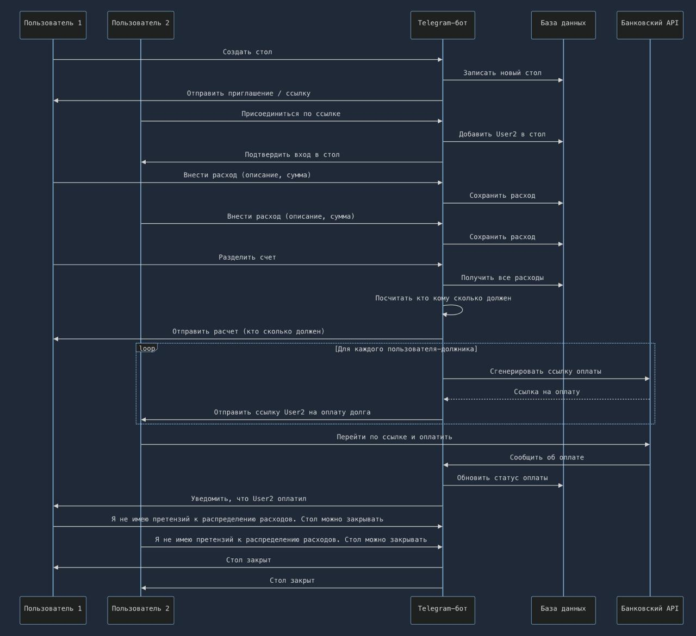

# Telegram-бот для разделения счетов

## 1. Краткое описание проекта

Telegram-бот — удобный сервис для коллективного управления расходами.  
Пользователь создает "стол", приглашает друзей, каждый отмечает свои траты. Бот автоматически рассчитывает, кто и сколько должен, генерирует индивидуальные платежные ссылки через банковские API, а процесс оплаты и статусы видны прямо в чате.

---

## 2. Сценарий взаимодействия пользователя

1. Создание общего стола (группы расходов).
2. Приглашение друзей по ссылке или нику или через уникальный идентификатор стола.
3. Добавление каждым участником своих трат.
4. Выбор способа деления (поровну, по позициям, по долям).
5. Автоматический расчет, кто сколько должен и минимизация количества переводов.
6. Генерация платежных ссылок для каждого участника через банковское API.
7. Отслеживание статусов оплат прямо в чате для каждого участника.
8. Закрытие стола после погашения долгов.

---

## 3. Схема взаимодействия

---

## 4. Что видит пользователь

- Главное меню: создание или вход за стол, список всех своих столов.
- Интерфейс добавления расходов: удобное внесение трат, прикрепление к участникам, возможность разделить платеж, между участниками стола
- Кнопки для выбора схемы раздела (поровну, по долям и т.д.).
- Итоговая таблица расчетов.
- Персональные кнопки-ссылки для быстрого перевода.
- Онлайн-статус: кто уже оплатил, кто нет. Уведомления о действиях друзей.

---

## 5. Задачи проекта

- Проработка основной логики Telegram-бота и команд (1 день)  --- делаем вместе
- Разработка макетов интерфейса бота (0.5 дня) --- Артем
- Разработка архитектуры БД (0.5 дней) --- Роман
- Реализация поддержки ввода и обработки расходов (2 дня) --- делаем вместе
- Реализация алгоритма минимизации переводов (0.5 дней) --- Артем
- Реализация интеграции с банками и генерации платежных ссылок (API) (1 день) --- Роман
- Реализация интерфейса статусов и оповещений (1 день) --- Артем
- Покрытие тестами, отладка кода (2 дня) --- делаем вместе
- Деплой, мониторинг (1 день) --- Роман

